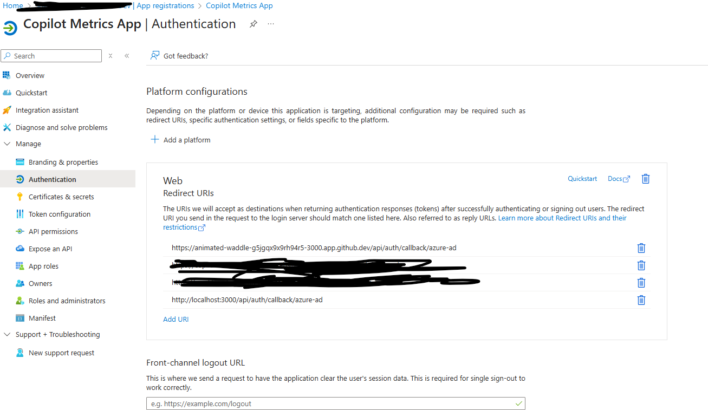
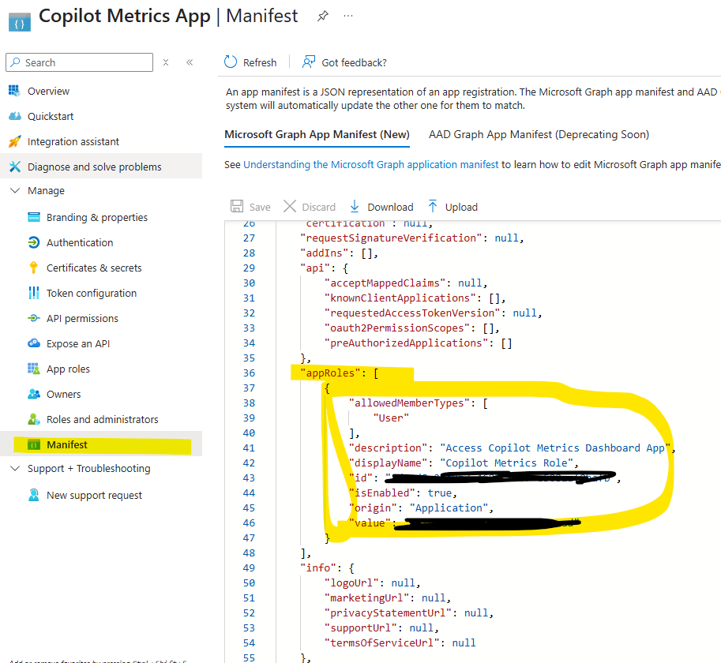
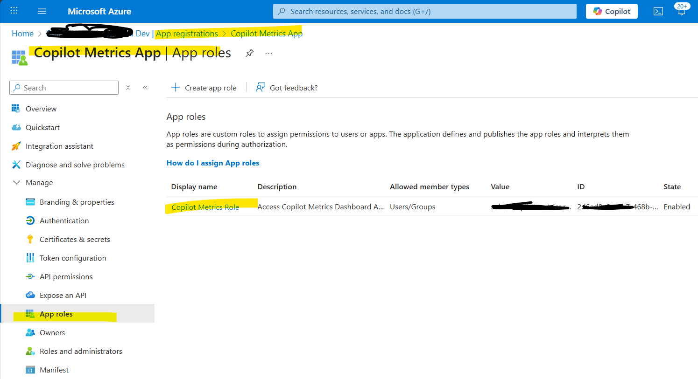
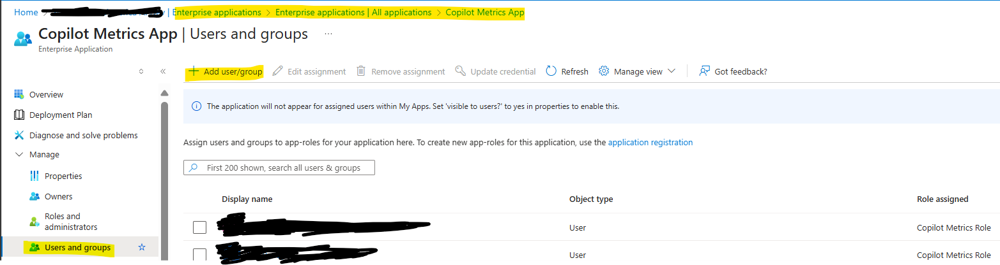
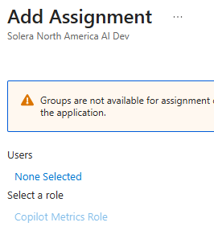

### Step 1: Find the App Role value
1. Azure Portal -> Microsoft Entra ID > App registrations 
1. Select your application ("Copilot Metrics Dashboard") > App roles > Get the Role Value column. 

### Step 2: Ensure Users/Groups are Assigned to the App Role
1. Microsoft Entra ID > Enterprise applications > Click on your application's name ( ame name as your App Registration).
1. Select Users and groups -> Click + Add user/group -> Select the users or security groups you want to assign a role to.
1. Under Select a role, choose the App Role you created (e.g., "Admin").
1. Click Assign.

